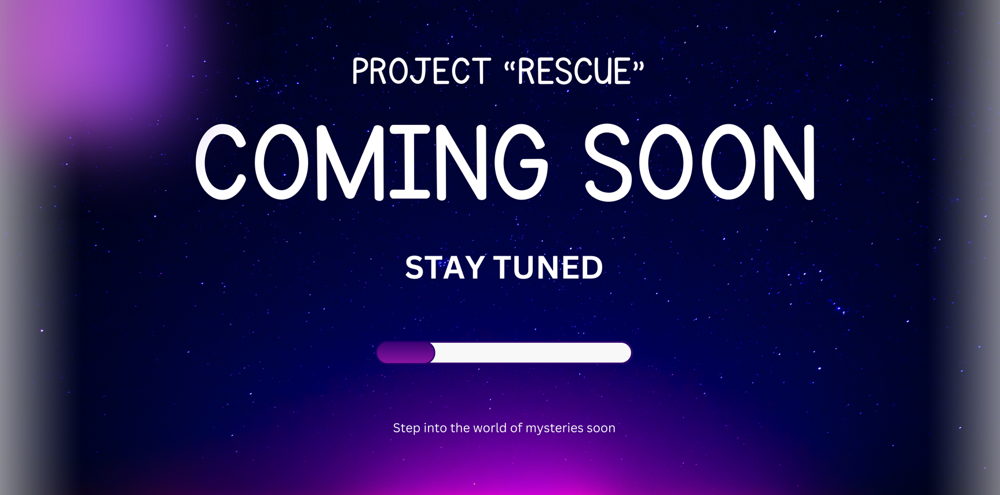

## Project Rescue

### 🔍 Unravel the Mystery

**Project Rescue** is an immersive mystery game where players navigate a world of secrets and hidden truths. Communicate through enigmatic chats, uncover clues, and solve puzzles to uncover the story behind Ollie's disappearance.

---

### 🔑 Features

- **Interactive Chat-Based Navigation**: Engage with characters through immersive chat interfaces.
- **Puzzle Solving**: Test your wits with challenging puzzles that unlock new parts of the story.
- **Engaging Storyline**: Dive into a captivating narrative filled with twists and turns.

---

### 🌐 Explore

- **Mysterious Locations**: From shadowy forests to abandoned warehouses, every location holds a secret.
- **Intriguing Characters**: Each character you meet has a story to tell and a clue to reveal.

---

### 🔗 Links

- **GitHub Repository**: [Project \"Rescue\"](https://github.com/Satviky/project-Rescue)
- **Development Logs**: [Website](https://project-Rescue.onrender.com)

---

### 📫 Contact

For more details, feel free to reach out:

- **Email**: [Satvik Gupta](mailto:it10800222125@gmail.com)
- For Any Query you can reach out to @mrengineer0510[^1]

---

- [x] ✔️Development Tracking website ready? 
- [x] ✔️Demo site updated 
- [ ] :x:Main Game Beta APK Ready? 
- [ ] :x: Game launched :tada: 

---
### 📊 Repository Activity

[^1]: Mr Engineer aka Nikhil Kumar.

